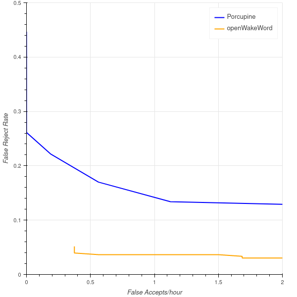
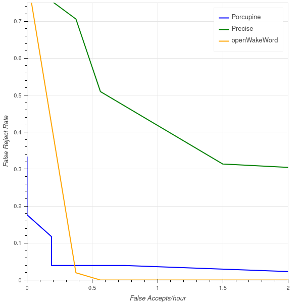

# openWakeWord

openWakeWord is an open-source wakeword library that can be used to create voice-enabled applications and interfaces. It includes pre-trained models for common words & phrases that work well in real-world environments.

# Demo

You can try an online demo of the included pre-trained models via HuggingFace Spaces [right here!](https://huggingface.co/spaces/davidscripka/openWakeWord).

Note that real-time detection of a microphone stream can occassionally behave strangely in Spaces. For the most reliable testing, perform a local installation as described below.

# Installation & Usage

Installing openWakeWord is simple and has minimal dependencies:

```
pip install openwakeword
```

To (optionally) use [Speex](https://www.speex.org/) noise suppresion on Linux systems to improve performance in noisy environments, install the Speex dependencies: `sudo apt-get install libspeexdsp-dev
` Many thanks to [TeaPoly](https://github.com/TeaPoly/speexdsp-ns-python) for their Python wrapper of the Speex noise supression libraries.

For quick local testing, use the included [example script](examples/detect_from_microphone.py) to try streaming detection from a local microphone.

Adding openWakeWord to your own Python code requires just a few lines:

```python
from openwakeword.model import Model

# Instantiate the model
model = Model(
    wakeword_model_paths=["path/to/model.onnx"],  # can also leave this argument empty to load all of the included pre-trained models
)

# Get an 80 ms audio frame containing 16-bit 16khz PCM audio data from a file, microphone, network stream, etc. 
frame = my_function_to_get_audio_frame()

# Get predictions for the frame
prediction = model.predict(frame)
```

## Reccomended Settings

While the default settings for openWakeWord will work well in many cases, there are adjustable parameters that can improve performance in some cases. On supported platforms (currently only X86 and Arm64 linux), Speex noise suppression can be enabled by setting the `enable_speex_noise_suppression=True` when instantiating an openWakeWord model. This can improve performance when relatively constant background noise is present. Second, a voice activity deteciton (VAD) model from [Silero](https://github.com/snakers4/silero-vad) is included with openWakeWord, and can be enabled by setting the `vad_threshold` argument to a value between 0 and 1 when instantiating an openWakeWord model. This will only allow a positive prediction from openWakeWord when the VAD model simultaneously has a score above the specified threshold, which can significantly reduce false-positive activations in the present of non-speech noise. Finally, all of the included openWakeWord models were trained to work well with a default threshold of `0.5` for a positive prediction, but you are encouraged to determine the best threshold for your environment and use-case through testing.

# Project Goals

openWakeWord has four high-level goals, which combine to (hopefully!) produce a framework that is simple to use *and* extend.

1) Be fast *enough* for real-world usage, while maintaining ease of use and development. For example, a single core of a Raspberry Pi 3 can run 15-20 openWakeWord models simultaneously in real-time. However, the models are likely still too large for less powerful systems or microcontrollers. Commercial options like [Picovoice Porcupine](https://picovoice.ai/platform/porcupine/) or [Fluent Wakeword](https://fluent.ai/products/wakeword/) are likely better suited for highly constrained hardware environments.

2) Be accurate *enough* for real-world usage. The included models are typically have false-accept and false-reject rates below the annoyance threshold for the average user. This is obviously subjective, by a false-accept rate of <0.5 per hour and a false-reject rate of <5% is often reasonable in practice. See the [Performance & Evaluation](#performance-and-evaluation) section for details about how well the included models can be expected to perform in practice.

2) Have a simple model architecture and inference process. Models process a stream of audio data in 80 ms frames, and return a score between 0 and 1 for each frame indicating the confideance that a wake word/phrase has been detected. All models also have a shared feature extraction backbone, so that each additional model only has a small impact to overall system complexity and resource requirements.

4) Require **little to no manual data collection** to train new models. The included models (see the [Pre-trained Models](#pre-trained-models) section for more details) were all trained with *100% synthetic* speech generated from text-to-speech models. Training new models is a simple as generating new clips for the target wake word/phrase and training a small model on top of of the frozen shared feature extractor. See the [Training New Models](#training-new-models) section for more details.

Future releases of openWakeWord will aim to stay aligned with these goals, even when adding new functionality.

# Pre-Trained Models

openWakeWord comes with pre-trained models for common words & phrases. Currently, only English models are supported, but they should be reasonably robust across different types speaker accents and pronunciation.

The table below lists each model, examples of the word/phrases it is trained to recognize, and the associated documentation page for additional detail. Many of these models are trained on multiple variations of the same word/phrase; see the individual documentation pages for each model to see all supported word & phrase variations.

| Model | Detected Speech | Documenation Page |
| ------------- | ------------- | ------------- |
| alexa | "alexa"| [docs](docs/models/alexa.md) |
| hey mycroft | "hey mycroft" | [docs](docs/models/hey_mycroft.md) |
| hey jarvis | "hey jarvis" | [docs](docs/models/hey_jarvis.md) |
| current weather | "what's the weather" | [docs](docs/models/weather.md) |
| timers | "set a 10 minute timer" | [docs](docs/models/timers.md) |

Based on the methods discussed in [performance testing](#performance-and-evaluation), each included model aims to meet the target performance criteria of <5% false-reject rates and <0.5/hour false-accept rates with appropriate threshold tuning. These levels are subjective, but hopefully are below the annoyance threshold where the average user becomes frustrated with a system that often misses intended activations and/or causes disruption by activating too frequently at undesired times. For example, at these performance levels a user could expect to have the model process continuous mixed content audio of several hours with at most a few false activations, and have a failed intended activation in only 1/20 attempts (and a failed retry in only 1/400 attempts). 

If you have a new wake word or phrase that you would like to see included in the next release, please open an issue, and we'll do a best to train a model! The focus of these requests and future release will be on words and phrases that have broad general usage versus highly specific application.

# Model Architecture

openWakeword models are composed of three separate components:

1) A pre-processing function that computes [melspectrogram](https://pytorch.org/audio/main/generated/torchaudio.transforms.MelSpectrogram.html) of the input audio data. For openWakeword, an ONNX implementation of Torch's melspectrogram function with fixed parameters is used to enable efficient performance across devices.

2) A shared feature extraction backbone model that converts melspectrogram inputs into general-purpose speech audio embeddings. This [model](https://arxiv.org/abs/2002.01322) is provided by [Google](https://tfhub.dev/google/speech_embedding/1) as a TFHub module under an [Apache-2.0](https://opensource.org/licenses/Apache-2.0) license. For openWakeWord, this model was manually re-implemented to separate out different functionality and allow for more control of architecture modifications compared to a TFHub module. The model itself is series of relatively simple convoluational blocks, and gains its strong performance from extensive pre-training on large amounts of data. This model is the core component of openWakeWord, and enables the strong performance that is seen even when training on fully-synthetic data.

3) A classification model that follows the shared (and frozen) feature extraction model. The structure of this classification model is arbitrary, but in practice a simple fully-connected network or 2 layer RNN works well.

# Performance and Evaluation

Evaluting wake word/phrase detection models is challenging, and it is often very difficult to assess how different models presented in papers or other projects will perform *when deployed* with respect to two critical metrics: false-reject rates and false-accept rates. For clarity in definitions:

A *false-reject* is when the model fails to detect an intended activation from a user.

A *false-accept* is when the model inadvertently activates when the user did not intend for it to do so.

For openWakeWord, evaluation follows two principles:

- The *false-reject* rate should be determined from wakeword/phrases that represent realistic recording environments, including those with background noise and reverberation. This can be accomplished by directly collected data from these environments, or simulating them with data augmentation methods.

- The *false-accept* rate should be determined from audio that represents the types of environments that would be expected for the deployed model, not just on the training/evaluation data. In practice, this means that the model should only rarely activate in error, even in the presence of hours of continuous speech and background noise.

While other wakeword evaluation standards [do exist](https://github.com/Picovoice/wake-word-benchmark), for openWakeWord it was decided that a custom evaluation would better indicate what performance users can expect for real-world deployments. Specifically:

1) *false-reject* rates are calculated from either clean recordings of the wakeword that are mixed with background noise at realistic signal-to-noise ratios (e.g., 5-10 dB) *and* reverberted with room Impulse Response Functions (RIRs) to better simulate far-field audio, *or* manually collected data from realistic deployment environments (e.g., far-field capture with normal environment noise).

2) *false-accept* rates are determined by using the [Dinner Party Corpus](https://www.amazon.science/publications/dipco-dinner-party-corpus) dataset, which represents ~5.5 hours of far-field speech, background music, and miscellaneous noise. This dataset sets a realistic (if challenging) goal for how many false activations might occur in a similar situation.

To illustrate how openWakeWord can produce capable models, the false-accept/false-reject curves for the included `"alexa"` model is shown below along with the performance of a strong commercial competitor, [Picovoice Porcupine](https://picovoice.ai/platform/porcupine/). Other existing open-source wakeword engines (e.g., [Snowboy](https://github.com/Kitt-AI/snowboy), [PocketSphinx](https://github.com/cmusphinx/pocketsphinx), etc.) are not included as they are either no longer maintained or demonstrate performance significantly below that of Porcupine. The positive test examples used were those included in [Picovoice's](https://github.com/Picovoice/wake-word-benchmark) repository, a fantastic resource that they have freely provided to the community. Note, however, that the test data was prepared differently compared to Picovoice's implementation (see the [Alexa model documentation](docs/models/alexa.md) for more details).



For at least this test data and preparation, openWakeWord produces a model that is more accurate than Porcupine.

As a second illustration, the false-accept/false-reject rate of the included `"hey mycroft"` model is shown below along with the performance of a [custom](https://picovoice.ai/docs/quick-start/porcupine-python/#custom-keywords) Picovoice Porcupine model and [Mycroft Precise](https://mycroft-ai.gitbook.io/docs/mycroft-technologies/precise). In this case, the positive test examples were manually collected from a male speaker with a relatively neutral American english accent in realistic home recording scenarios (see the [Hey Mycroft model documentation](docs/models/hey_mycroft.md) for more details).



Again, for at least this test data and prepration, openWakeWord produces a model at least as good as existing solutions.

However, in should noted that for both of these tests sample sizes are small and there are issues ([1](https://github.com/Picovoice/wake-word-benchmark/issues/13), [2](https://github.com/MycroftAI/mycroft-precise/issues/237)) with the evaluation of the other libraries that suggest these results should be interpreted cautiously. As such, the only claim being made is that openWakeWord models are broadly competitive with comparable offerings. You are strongly encouraged to [test openWakeWord](#installation--usage) to determine if it will meet the requirements of your use-case.

Finally, to give evidence that the core methods behind openWakeWord (i.e., pre-trained speech embeddings and high-quality synthetic speech) are effective across a wider range of wake word/phrase structure and length, the table below shows the performance on the [Fluent Speech Commands](https://paperswithcode.com/sota/spoken-language-understanding-on-fluent) test set using an openWakeWord model and the baseline method shown in a [related paper by the dataset authors](https://arxiv.org/abs/1910.09463). While both models were trained on fully-synthetic data, due to fundamentally different data synthesis & preparation, training, and evaluation approaches, the numbers below are likely not directly comparable. Rather, the important conclusion is that openWakeWord is a viable approach for the task of spoken language understanding (SLU).

| Model | Test Set Accuracy | Link |
| ------------- | ------------- | ------------- |
| openWakeWord | ~97.5% | NA |
| encoder-decoder | ~94.9% | [paper](https://arxiv.org/abs/1910.09463) |


If you are aware of other open-source wakeword/phrase libraries that should be added to these comparisons, or have suggestions on how to improve the evaluation more generally, please open an issue! We are eager to continue improving openWakeWord by learning how others are approaching this problem.

## Other Performance Details

### Model Robustness

Due to a combination of variability in the generated speech and the extensive pre-training from Google, openWakeWord models also demonstrate some additional performance benefits that are useful for real-world applications. In testing, three in particular have been observed.

1) The trained models seem to respond reasonably well to wakewords and phrases that are [whispered](https://en.wikipedia.org/wiki/Whispering). This is somewhat surprising behavior, as the text-to-speech models used for producing training data generally do not create synthetic speech that has acoustic qualities similar to whispering.

2) The models also respond relatively well to wakewords and phrases spoken at different speeds (within reason).

3) The models are able to handle some variability in the phrasing of a given command. This behavior was not entirely a surpise, given that [others](https://arxiv.org/abs/1904.03670) have reported similar benefits when training end-to-end spoken language understanding systems. For example, the included [pre-trained weather model](docs/models/weather.md) will typically still respond correctly to a phrase like "how is the weather today" despite not training directly on that phrase (though false rejections rates will likely be higher, on average, compared to phrases closer to the training data).

### Background Noise

While the models are trained with background noise to increase robustness, in some cases additional noise suppresion can improve performance. Setting the `enable_speex_noise_suppression=True` argument during openWakeWord model initialization will use the efficient Speex noise suppresion algorithm to pre-process the audio data prior to prediction. This can reduce both false-reject rates and false-accept rates, though testing in a realistic deployment environment is strongly reccomended.

# Training New Models

Training new models is conceptually simple and requires just a few steps:

1) Generate new training data for the desired wakeword/phrase using open-source speech-to-text systems (see [Synthetic Data Generation](docs/synthetic_data_generation.md) for more details). These models and the generation code will provided in a forthcoming separate repository. The number of generated examples required can vary, a minimum of several thousand is recommended and performance seems to increase smoothly with increasing dataset size.

2) Collect negative data (e.g., audio where the wakeword/phrase is not present) to help the model have a low false-accept rate. This also benefits from scale, and the [included models](#pre-trained-models) were all trained with ~30,000 hours of negative data representing speech, noise, and music. See the individual model documentation pages for more details on training data curation and preparation.

# Language Support

Currently, openWakeWord only supports English, primarily because the pre-trained text-to-speech models used to generate training data are all based on english datasets. It's likely that speech-to-text models trained on other languages would also work well, but non-english models & datasets are less commonly available.

Future release roadmaps may have non-english support. In particular, [Mycroft.AIs Mimic 3](https://github.com/MycroftAI/mimic3-voices) TTS engine may work well to help extend some support to other languages.

# License

All of the code in openWakeWord is licensed under the **Apache 2.0** license. All of the included pre-trained models are licensed under the [Creative Commons Attribution-NonCommercial-ShareAlike 4.0 International](https://creativecommons.org/licenses/by-nc-sa/4.0/) license due to the inclusion of datasets with unknown or restrictive licensing as part of the training data. If you are interested in pre-trained models with more permissive licensing, please raise an issue and we will try to add them to a future release.